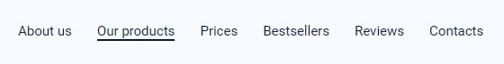
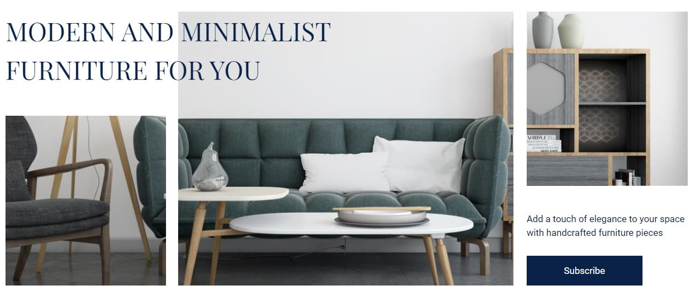
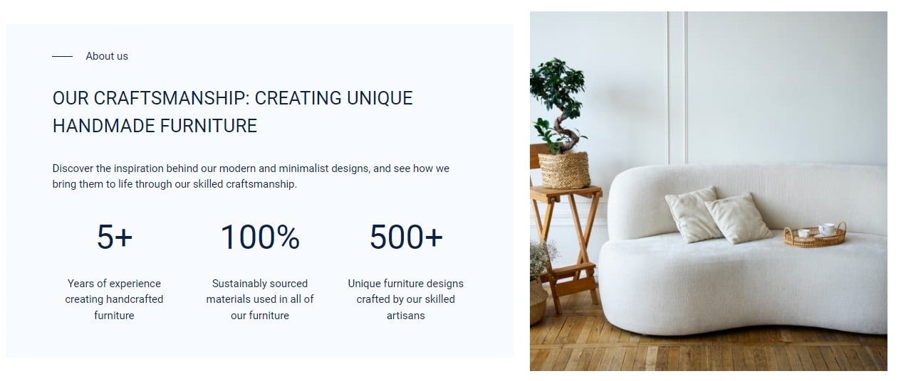
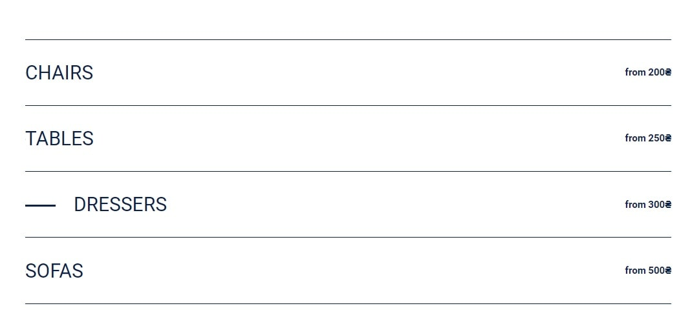
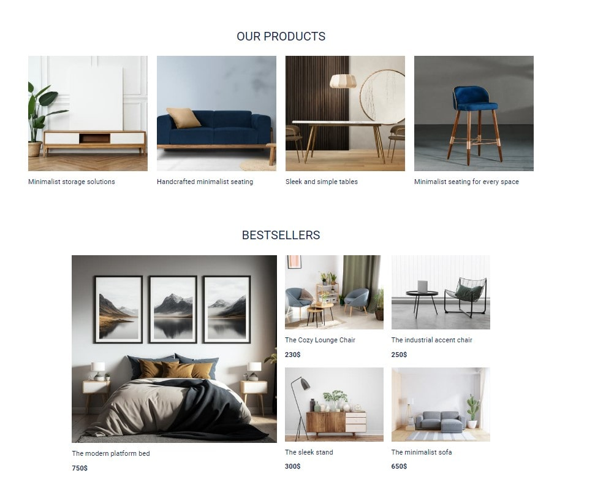
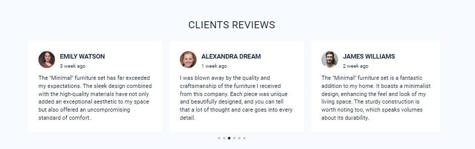
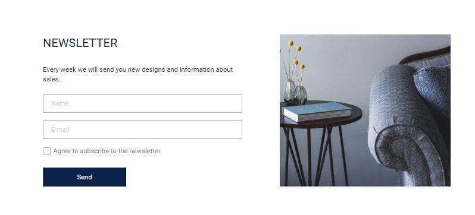
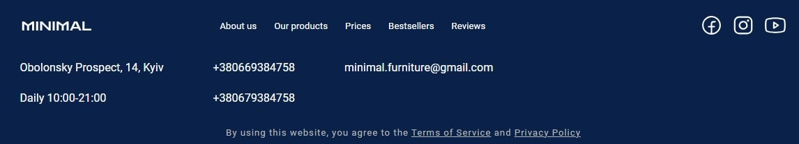

# Проект Minimal

Проект "Minimal" - веб-сайт, що спеціалізується на продажу мінімалістичної та
сучасної мебелі.

Цей проект було реалізовано в рамках навчального курсу та з метою засвоєння
пройденого матеріалу модуля HTML/CSS.

## Склад команди (секція)

### Team-lead

Ігор Яремкевич (Bestsellers)

### Scrum master

Ілона Симонік (Clients reviews)

### Developers

- Артем Токарев (About Us, Price)
- Лоліта Єнік (Hero)
- Герман Шевченко (Header, Footer)
- Альона Бойко (Subscription)
- Алла Павловська (Our products)

## Опис проекту

### Header

`«Header»` - те, з чого розпочинається подорож по сайту. Наша навігація є
простою та зрозумілою.

А мобільне меню сприяє зручності використання на мобільних пристроях.

### Hero

Секція `«Hero»` захоплює увагу візуально привабливим дизайном та важливою
інформацією. Анімація заголовка та кнопка, що направляє до форми, забезпечують
зручність у користуванні.

### About us

Секція `«About us»` містить важливу інформацію про компанію.

### Price

Секція `«Price»` допомагає користувачам зорієнтуватись в цінах продукції.

### Products & Bestsellers

Секції `«Products»` та `«Bestsellers»` дозволяють переглянути зображення
товарів.

### Reviews

Секція `«Reviews»` дозволяє користувачам ознайомитись з думками інших покупців.
Зручний `«slider»` дозволяє комфортно проглядати відгуки на різних пристроях.

### Subscription

Секція `«Subscription»` є однією з найважливіших секцій, оскільки встановлює
прямий зв'язок між компанією та її клієнтами. Проста та зрозуміла форма
допомагає користувачам зареєструватись для отримання інформації про нові
продукти та знижки.

### Footer

Секція `«Footer»` містить основну інформацію для зв'язку з компанією. Тут
розташовані її логотип, навігаційні посилання на інші секції, адреса, телефон та
посилання на соціальні мережі.

