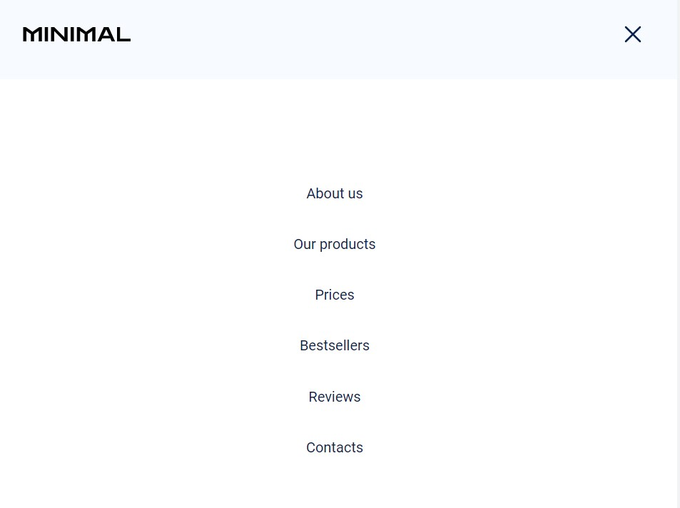

# Проект Minimal

Проект "Minimal" - веб-сайт, що спеціалізується на продажу мінімалістичної та
сучасної мебелі.

Цей проект було реалізовано в рамках навчального курсу та з метою засвоєння
пройденого матеріалу модуля HTML/CSS.

## Склад команди (секція)

### Team-lead

Ігор Яремкевич (Bestsellers)

### Scrum master

Ілона Симонік (Clients reviews)

### Developers

- Артем Токарев (About Us, Price)
- Лоліта Єнік (Hero)
- Герман Шевченко (Header, Footer)
- Альона Бойко (Subscription)
- Алла Павловська (Our products)

## Опис проекту

### Header

`«Header»` - те, з чого розпочинається подорож по сайту. Наша навігація є
простою та зрозумілою.

!(./assets/nav.jpg)

А мобільне меню сприяє зручності використання на мобільних пристроях.

### Hero

Секція `«Hero»` захоплює увагу візуально привабливим дизайном та важливою
інформацією. Анімація заголовка та кнопка, що направляє до форми, забезпечують
зручність у користуванні.

### About us

Секція `«About us»` містить важливу інформацію про компанію.

